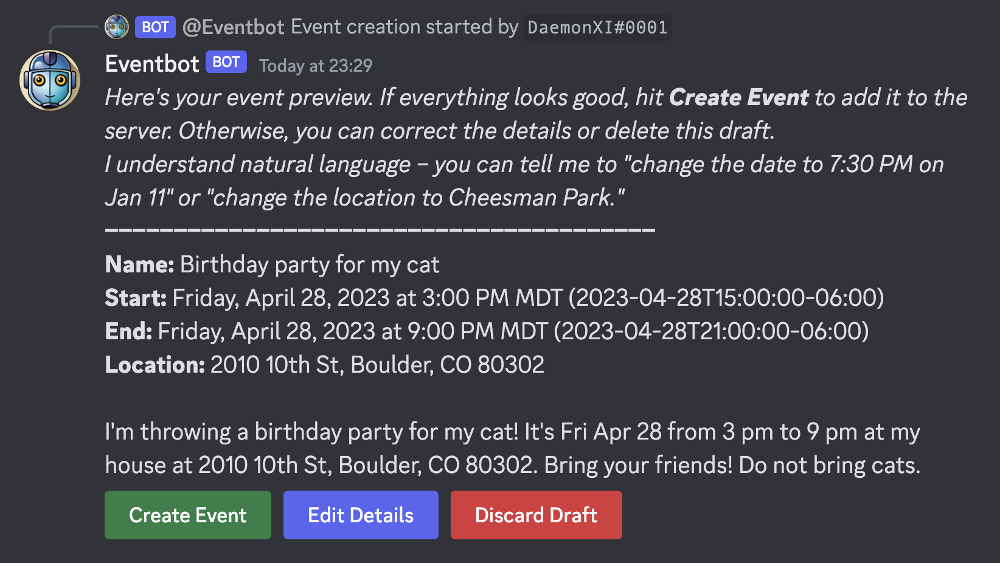
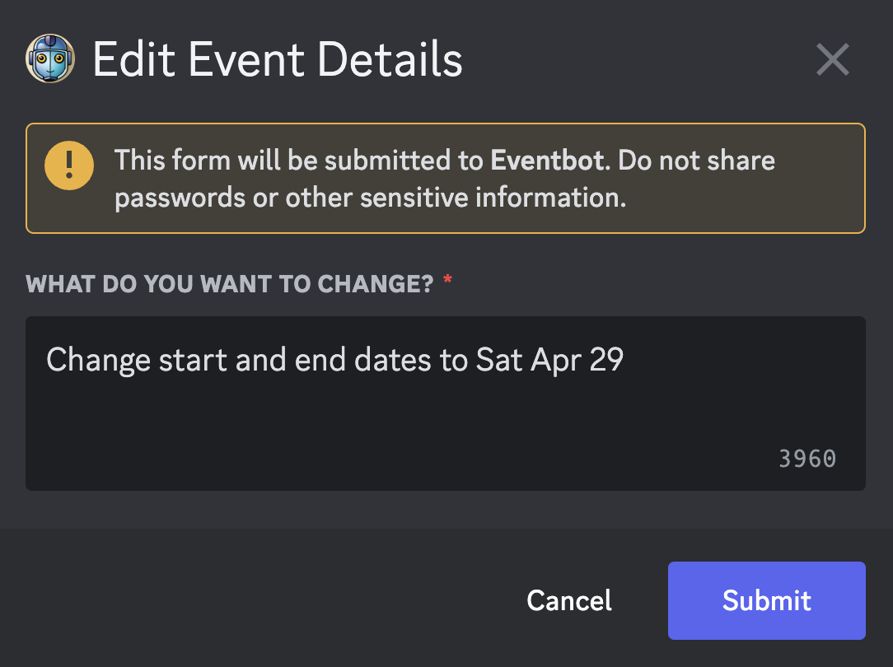
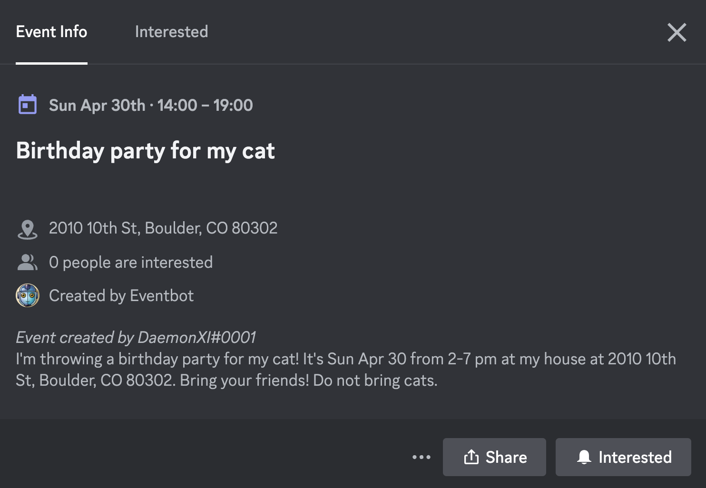

# :robot: Eventbot

Create events in your Discord server using natural language.

[Invite the bot.](https://discord.com/api/oauth2/authorize?client_id=1095402658719862925&permissions=17592186046464&scope=bot)

# Usage

Invite the bot to your server and create a channel called `#eventbot`.

This bot responds only in channels named `#eventbot`, so gate that channel to mods/admins only if you don't want normal users adding their own events.

In `#eventbot`, tag the bot with your full event details:

> @Eventbot I'm throwing a birthday party for my cat! It's Fri Apr 28 from 3 pm to 9 pm at my house at 2010 10th St, Boulder, CO 80302. Bring your friends! Do not bring cats.

The bot will build a draft for you:

The bot uses OpenAI GPT to parse the details, so it might get some things wrong. Select **Edit Details** and you can update the details for your event using natural language:

_Protip: If you're struggling to update the details, in particular the event date/times, try deleting your draft and starting from scratch with a corrected event message._

When everything looks good, select **Create Event** to add it to your server:

